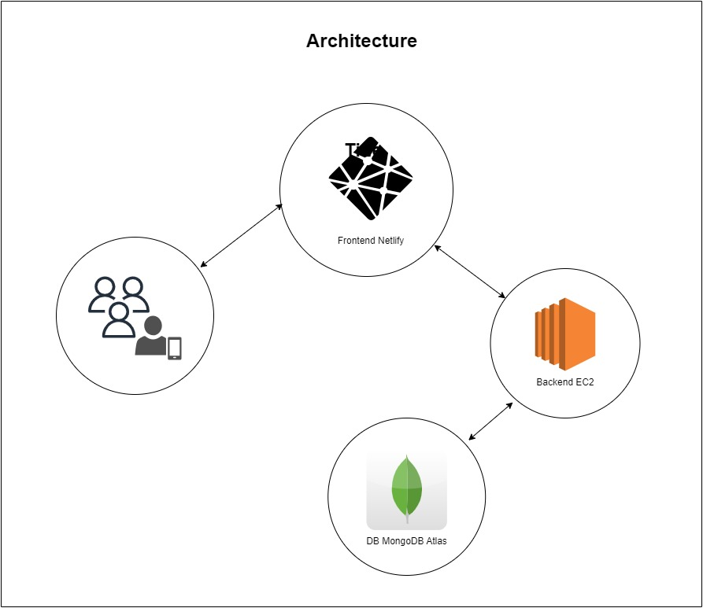

# [Goal Tracker]

## Introduction
This app aims to help user to create and track there goals. Some of the features of the app includes.
- Login
- SignUp
- Create your goals.
- Edit your Goals.
- Delete your goals.
- Add Task to your goals.
- Edit your task.
- Delete your task.
- Mark your task as complete.

## Architecture

## Database ERD

## Technologies Used
- Frontend
    - React
    - MUI 
    - Joi
    - React Router Dom
    - Axios

- Backend
    - Node
    - Express 
    - Mongoose
    - Joi

- Database
    - MongoDB

- Error Tracking Frontend
    - Sentry

## Project Structure
Outline the directory structure of the project, including important files and folders. Describe the purpose of each major component.

/web-app
├── /frontend-goal-tracker # Frontend React App
├── /backend-goal-tracker # Backend Node.js Server

## Setup Instructions
Please follow the step-by-step instructions on how to set up the development environment and run the web app locally.

### Frontend Setup:
1. Navigate to the `frontend-goal-tracker` directory.
2. Run `npm install` to install dependencies.
3. Run `npm start` to start the app on port 3000
   
### Backend Setup:
1. Navigate to the `server` directory.
2. Run `npm install` to install dependencies.
3. Run `npm start` to start the server locally.

## Testing
- Currently the application was manually tested.
- Future Scope : (For both Frontend and Backend)
    - Unit Test
    - Integration Test 
    - E2E Test

## Deployment
- The Frontend is currently deployed on Netlify.
- The Backend is currently deployed on AWS EC2.
- The Database is currently deployed on MongoDB.

- Future Scope :
    - Setting up CI/CD pipeline with various stages e.g: linting, build, Git tag creation, and deployment(dev and prod env)

## Monitoring and Maintenance

- Frontend 

- Backend

## Security Considerations
Following are the security measures taken 
- Rate Limiter
- 